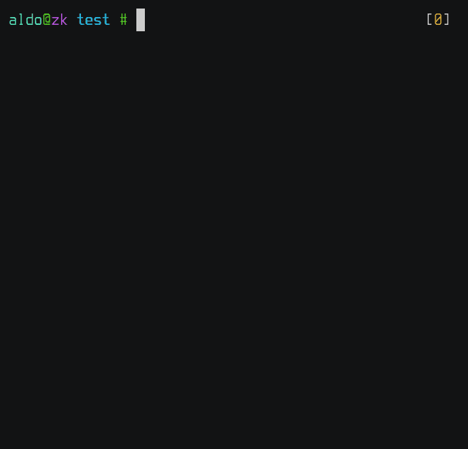

# Quiren (Quick Editor Renamer)

Edits the filenames of the current directory on the editor of your choice.



## Installation

From crates.io:

```shell
$ cargo install quiren
```

From the git repository:

```shell
$ git clone https://github.com/Sinono3/quiren.git
$ cargo install --path quiren
```

## Usage

```
Usage: quiren [options] [dir]

Options:
    -h, --help      Prints help information
    -r, --retry     Re-enters the editor after an error
    -d, --delete    Delete files removed in the editor
```

Examples:

```shell
# On the current directory
$ quiren
# On another directory
$ quiren books
$ quiren /home/dude/abc/
```

## Origin

I was looking for a tool that would let me edit filenames for the current directory in Vim. If I looked a little bit more into it I probably would have found something that suited my needs, but I thought trying to make it myself would be a fun project, so here we are.
